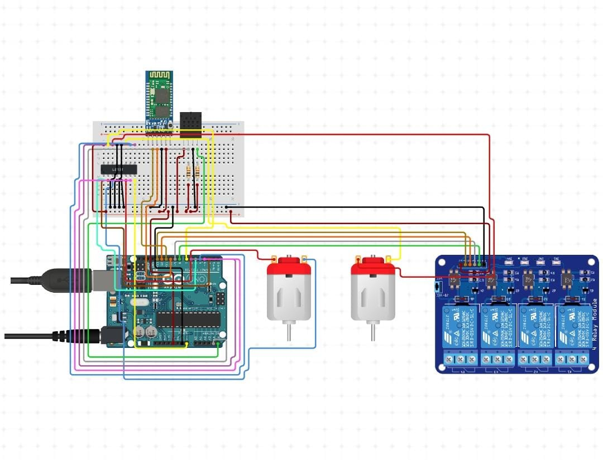

# SmartHome Using Arduino and Flutter

## Requirements:

- Hardware:
    1. Arduino Uno R3
    2. Breadboard half size
    3. DHT22 Temperature and Humidity sensor
    4. HC-05 Bluetooth Module
    5. Jumper Wires F/M
    6. Jumper wires M/M
    7. 5V 4-channel Relay Module
    8. 9 V battery
    9. L293D Motor Driver IC
    10. TT Gearmotors

- Software:
    1. Arduino IDE
    2. VS Code

- Technology used for the app:
    1. Flutter 

## Literature review:
  This project is developed for the people who are physically disabled or the people who cannot get up and control the devices manually for whatsoever reasons. 

## About the Project:

We've developed this project in respect to the partial fulfillment of requirements for the fourth semester of Bachelors in Engineering from Electronics and Telecommunication Branch.  
Through this project, Users can control all the electrical devices such as fan, AC , Lights, T.V, etc from their mobile phone. We've also developed a mobile app using Flutter to control all the devices.

#### Connections:

  

Here I have attached the circuit diagram for the project.

Arduino Uno is the brain of the system. Two DC Motors are connected to the output pins of L293D Motor Driver IC. One DC motor will control the opening and closing of the door and the other motor will be the fan. The input pins of the L293D is connected to Arduino Uno to receive commands.  
All the electrical devices will be connected to the relay module. For our prototype, we've used a 4 channel relay module but the number of channels can be increased according to the requirement. the Input pins of relay module are connected to the Arduino Uno to receive commands.  
DHT22 Temperature and humidity sensor is connected to arduino to get the temperature and humidity values of the house.  
HC-05 Bluetooth Module is used for communication between Arduino and Android app. This enables Serial communication. All the commands we give via BLuetooth will be transmitted from Bluetooth (TX Pin) and will be received by Arduino (RX Pin) and then Arduino will process the data and send data to the respective component. Arduino will transmit data which is to be sent to the android app via TX Pin and that data will be received by the HC-05 Module through the RX Pin. This is why the RX pin of HC-05 is connected to TX of Arduino and TX pin of HC-05 is connected to RX of Arduino.